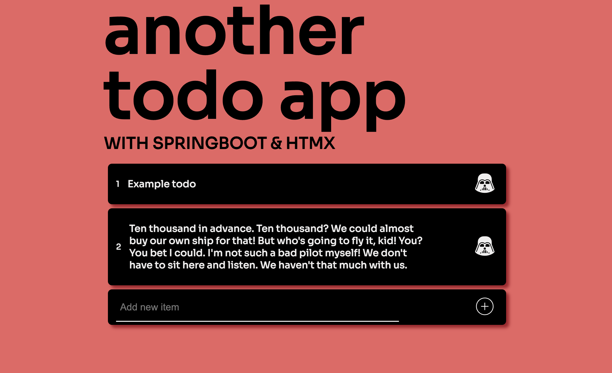

# Another todo-app

Another todo app used as an exploration step in HTMX

## Next steps

1. Reusable components (*create a basic design system*)
2. Client side validations

## License

[MIT](https://choosealicense.com/licenses/mit/)